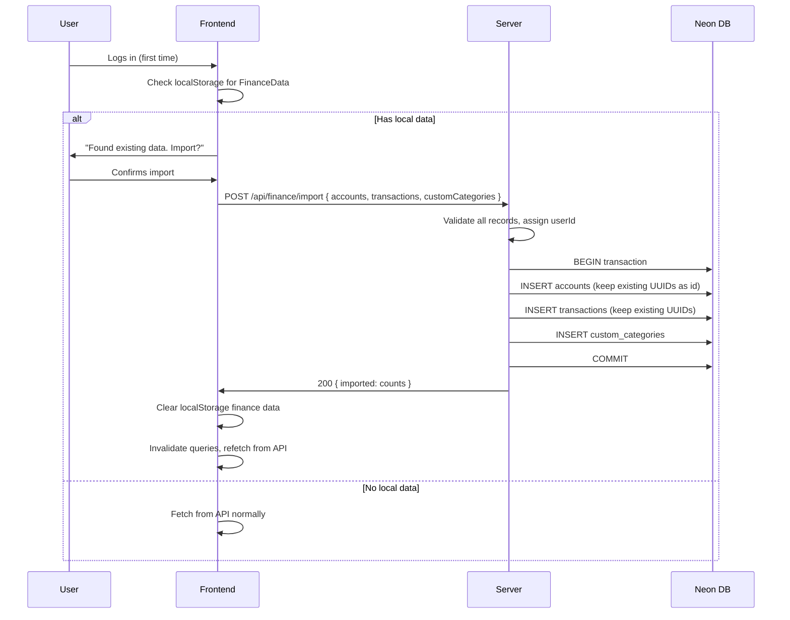

# Design: Backend API + Authentication + Guest Mode

## Technical Approach

Dual-mode persistence behind a strategy interface. The existing `useFinanceMutation` optimistic pattern stays intact -- only the persistence target swaps between localStorage (guest) and Hono REST API (authenticated). Better Auth mounts as a Hono sub-app. Drizzle ORM manages domain tables alongside Better Auth's managed tables in Neon PostgreSQL.

## Architecture Decisions

| Decision | Choice | Alternatives | Rationale |
|----------|--------|-------------|-----------|
| Persistence abstraction | Strategy object (`PersistenceStrategy`) injected via React context | Conditional `if/else` in each hook; separate hook files per mode | Single swap point, hooks stay unchanged, testable in isolation |
| Auth state detection | `useSession()` from `better-auth/react` checked in a top-level `AuthProvider` that sets the active strategy | Check session in every hook; use route-based detection | Centralized, avoids duplicated checks, session is reactive |
| API granularity | Individual CRUD endpoints per resource (not bulk-save-all) | Single `/api/finance` PUT that saves the whole blob like localStorage | Granular = less data over wire, proper REST semantics, concurrent-safe |
| Money serialization | `string` in API JSON responses, `number` in frontend types (parse at API layer) | Keep as `number` everywhere; use a Money value object | Avoids IEEE 754 drift in transit while keeping existing frontend math intact |
| Query key structure | Expand `financeKeys` to per-resource keys with filters | Keep single `['finance']` key | Granular invalidation, pagination support, no full-cache replacement |
| Server entry | `@hono/node-server` standalone process on port 3001 | `@hono/vite-dev-server` (Vite plugin) | Decoupled from Vite, simpler deployment story, user chose this |

## Data Flow

### Guest Mode (unchanged)

```
Component -> useFinanceMutation -> optimistic cache update
                                -> localStorage write
                                -> onSuccess: confirm cache
```

### Authenticated Mode

```
Component -> useFinanceMutation -> optimistic cache update
                                -> fetch('/api/resource', { method, body })
                                -> onSuccess: confirm cache with server response
                                -> onError: rollback cache
```

### Strategy Resolution

```
App boot -> AuthProvider
              |-- useSession() -> authenticated?
              |     YES -> set ApiPersistence strategy
              |     NO  -> set LocalPersistence strategy
              |-- <PersistenceContext.Provider value={strategy}>
                    |-- <App />  (hooks consume strategy from context)
```

## Database Schema (Drizzle)

```typescript
// server/db/schema.ts
import { pgTable, text, uuid, numeric, timestamp, index } from 'drizzle-orm/pg-core'

// Better Auth tables: user, session, account, verification
// Managed by Better Auth -- DO NOT define manually.
// Reference user.id as text FK.

export const financeAccount = pgTable('finance_account', {
  id:             uuid('id').primaryKey().defaultRandom(),
  userId:         text('user_id').notNull(),  // FK to Better Auth user.id
  name:           text('name').notNull(),
  currency:       text('currency').notNull(), // 'USD'|'VES'|'EUR'|'COP'|'MXN'
  initialBalance: numeric('initial_balance', { precision: 12, scale: 2 }).notNull().default('0'),
  createdAt:      timestamp('created_at').defaultNow(),
}, (t) => [
  index('fa_user_idx').on(t.userId),
])

export const transaction = pgTable('transaction', {
  id:          uuid('id').primaryKey().defaultRandom(),
  userId:      text('user_id').notNull(),
  accountId:   uuid('account_id').notNull().references(() => financeAccount.id, { onDelete: 'cascade' }),
  type:        text('type').notNull(),        // 'income'|'expense'
  amount:      numeric('amount', { precision: 12, scale: 2 }).notNull(),
  description: text('description').notNull().default(''),
  category:    text('category').notNull(),
  date:        timestamp('date').notNull(),
  createdAt:   timestamp('created_at').defaultNow(),
}, (t) => [
  index('tx_user_idx').on(t.userId),
  index('tx_account_idx').on(t.accountId),
  index('tx_date_idx').on(t.userId, t.date),
])

export const customCategory = pgTable('custom_category', {
  id:        uuid('id').primaryKey().defaultRandom(),
  userId:    text('user_id').notNull(),
  name:      text('name').notNull(),
  type:      text('type').notNull(),           // 'income'|'expense'
  color:     text('color').notNull(),
  createdAt: timestamp('created_at').defaultNow(),
}, (t) => [
  index('cc_user_idx').on(t.userId),
])
```

**Note on CASCADE**: Better Auth manages `user` table and its own FKs. Our domain tables reference `user.id` via text column. We add application-level cascade (delete user data when user is deleted) via Better Auth's `onUserDelete` hook, NOT via DB-level FK constraints -- because Better Auth's table structure is opaque to us.

## Server Architecture

```
server/
  index.ts              -- Hono app, mount auth + API routes, start server
  auth.ts               -- Better Auth instance config (Drizzle adapter, email/password)
  routes/
    accounts.ts         -- GET/POST/PUT/DELETE /api/accounts
    transactions.ts     -- GET/POST/PUT/DELETE /api/transactions
    categories.ts       -- GET/POST /api/categories
    finance.ts          -- GET /api/finance (bulk), POST /api/finance/import
  db/
    schema.ts           -- Drizzle schema (above)
    index.ts            -- Neon connection + drizzle() instance
  middleware/
    auth.ts             -- Verify session, attach userId to context
drizzle.config.ts       -- Drizzle Kit config (root level)
tsconfig.server.json    -- Server TypeScript config (root level)
```

### Hono App Structure

```typescript
// server/index.ts
const app = new Hono()

app.use('/api/*', cors({ origin: ALLOWED_ORIGINS, credentials: true }))
app.on(['POST','GET'], '/api/auth/**', (c) => auth.handler(c.req.raw))
app.use('/api/*', authMiddleware)  // all /api/* except auth require session

app.route('/api/accounts', accountRoutes)
app.route('/api/transactions', transactionRoutes)
app.route('/api/categories', categoryRoutes)
app.route('/api/finance', financeRoutes)

serve({ fetch: app.fetch, port: 3001 })
```

### Auth Middleware Pattern

```typescript
// server/middleware/auth.ts
export const authMiddleware: MiddlewareHandler = async (c, next) => {
  const session = await auth.api.getSession({ headers: c.req.raw.headers })
  if (!session) return c.json({ error: 'Unauthorized' }, 401)
  c.set('userId', session.user.id)
  c.set('session', session)
  await next()
}
```

## API Route Design

| Method | Path | Request Body | Response | Notes |
|--------|------|-------------|----------|-------|
| `POST/GET` | `/api/auth/**` | varies | varies | Better Auth handles entirely |
| `GET` | `/api/accounts` | -- | `Account[]` | Scoped by userId |
| `POST` | `/api/accounts` | `{ name, currency, initialBalance }` | `Account` | Returns created |
| `PUT` | `/api/accounts/:id` | `{ name, currency, initialBalance }` | `Account` | Ownership check |
| `DELETE` | `/api/accounts/:id` | -- | `204` | Cascades transactions |
| `GET` | `/api/transactions?accountId=&month=&type=` | -- | `{ data: Transaction[], total: number }` | Filterable, paginated (limit/offset) |
| `POST` | `/api/transactions` | `{ accountId, type, amount, description, category, date }` | `Transaction` | |
| `PUT` | `/api/transactions/:id` | same as POST | `Transaction` | Ownership check |
| `DELETE` | `/api/transactions/:id` | -- | `204` | |
| `GET` | `/api/categories` | -- | `CustomCategory[]` | |
| `POST` | `/api/categories` | `{ name, type }` | `CustomCategory` | Server picks color |
| `GET` | `/api/finance` | -- | `FinanceData` | Bulk fetch (initial load) |
| `POST` | `/api/finance/import` | `FinanceData` | `{ imported: { accounts, transactions, categories } }` | Wrapped in DB transaction |

**Pagination**: `GET /api/transactions` accepts `limit` (default 50), `offset` (default 0). Returns `{ data, total }`. Frontend uses TanStack Query's `keepPreviousData` for smooth pagination.

**Amount handling**: API accepts `number` in request body, returns `string` for amount fields. Frontend API layer parses strings to numbers before setting query cache.

## Dual-Mode Persistence Strategy

```typescript
// src/lib/persistence.ts
interface PersistenceStrategy {
  fetchAll(): Promise<FinanceData>
  createAccount(input: CreateAccountInput): Promise<Account>
  updateAccount(input: UpdateAccountInput): Promise<Account>
  deleteAccount(id: string): Promise<void>
  fetchTransactions(filters?: TxFilters): Promise<{ data: Transaction[]; total: number }>
  createTransaction(input: CreateTxInput): Promise<Transaction>
  updateTransaction(input: UpdateTxInput): Promise<Transaction>
  deleteTransaction(id: string): Promise<void>
  fetchCategories(): Promise<CustomCategory[]>
  createCategory(input: CreateCategoryInput): Promise<CustomCategory>
  importData(data: FinanceData): Promise<ImportResult>
}
```

- `LocalPersistence` implements using `storage.ts` functions (existing behavior).
- `ApiPersistence` implements using `fetch('/api/...')` calls.
- `PersistenceContext` provides the active strategy.
- `useFinanceMutation` consumes the strategy from context instead of calling `persistFinanceData` directly.

### Optimistic Updates (Authenticated)

The current `useFinanceMutation` pattern maps cleanly:
1. `onMutate`: Cancel queries, snapshot cache, apply optimistic update using existing pure functions (`addAccount`, `addTransaction`, etc.)
2. `mutationFn`: Call `strategy.createAccount(input)` (API fetch)
3. `onError`: Rollback to snapshot
4. `onSuccess`: Replace optimistic data with server response (has server-generated timestamps, etc.)

The pure functions in `finance-store.ts` remain unchanged -- they're still used for optimistic cache transforms.

## Frontend Auth Integration

```typescript
// src/lib/auth-client.ts
import { createAuthClient } from 'better-auth/react'
export const { useSession, signIn, signUp, signOut } = createAuthClient({
  baseURL: '/api/auth',
})
```

### App Boot Sequence

```
<QueryClientProvider> -> <AuthProvider> -> <App>
                           |
                           useSession()
                           |-- loading -> Splash/spinner
                           |-- authenticated -> ApiPersistence + check localStorage import
                           |-- unauthenticated -> LocalPersistence (guest mode)
```

### Login/Register Flow

New page/modal with email + password fields. On success: `useSession` reactively updates, `AuthProvider` swaps strategy to `ApiPersistence`, TanStack Query refetches with new `queryFn`.

## Data Import Flow



**ID handling**: Existing UUIDs from `crypto.randomUUID()` are valid PostgreSQL UUIDs. Keep them as-is during import (pass as `id` field). Server uses provided IDs instead of `defaultRandom()`.

## Dev Environment

### Vite Proxy

```typescript
// vite.config.ts addition
server: {
  proxy: {
    '/api': { target: 'http://localhost:3001', changeOrigin: true }
  }
}
```

### Scripts

```json
{
  "dev": "concurrently -n web,api -c cyan,yellow \"vite\" \"tsx watch server/index.ts\"",
  "dev:web": "vite",
  "dev:server": "tsx watch server/index.ts",
  "db:generate": "drizzle-kit generate",
  "db:migrate": "drizzle-kit migrate",
  "db:studio": "drizzle-kit studio"
}
```

### Environment Variables

```
# .env (gitignored)
DATABASE_URL=postgresql://...@...neon.tech/miplatita?sslmode=require
BETTER_AUTH_SECRET=<random-32-char-string>
BETTER_AUTH_URL=http://localhost:3001
```

### TypeScript Config

```jsonc
// tsconfig.server.json
{
  "compilerOptions": {
    "target": "ES2022",
    "module": "NodeNext",
    "moduleResolution": "NodeNext",
    "outDir": "./dist/server",
    "strict": true,
    "skipLibCheck": true,
    "esModuleInterop": true,
    "verbatimModuleSyntax": true,
    "noEmit": true
  },
  "include": ["server"]
}
```

Add `{ "path": "./tsconfig.server.json" }` to root `tsconfig.json` references.

## Expanded Query Keys

```typescript
// src/lib/query-keys.ts
export const financeKeys = {
  all:          ['finance'] as const,
  accounts:     ['finance', 'accounts'] as const,
  transactions: (filters?: TxFilters) => ['finance', 'transactions', filters] as const,
  categories:   ['finance', 'categories'] as const,
}
```

## File Changes

| File | Action | Description |
|------|--------|-------------|
| `server/index.ts` | Create | Hono app entry, mount routes, start server |
| `server/auth.ts` | Create | Better Auth config with Drizzle adapter |
| `server/db/schema.ts` | Create | Drizzle schema for domain tables |
| `server/db/index.ts` | Create | Neon connection + drizzle instance |
| `server/middleware/auth.ts` | Create | Session verification middleware |
| `server/routes/accounts.ts` | Create | Account CRUD routes |
| `server/routes/transactions.ts` | Create | Transaction CRUD routes with filters |
| `server/routes/categories.ts` | Create | Category routes |
| `server/routes/finance.ts` | Create | Bulk fetch + import routes |
| `drizzle.config.ts` | Create | Drizzle Kit config |
| `tsconfig.server.json` | Create | Server TypeScript config |
| `.env.example` | Create | Template for env vars |
| `src/lib/persistence.ts` | Create | PersistenceStrategy interface + implementations |
| `src/lib/auth-client.ts` | Create | Better Auth React client |
| `src/lib/api.ts` | Create | Typed fetch wrapper for API calls |
| `src/contexts/AuthProvider.tsx` | Create | Auth + persistence strategy provider |
| `src/components/auth/LoginForm.tsx` | Create | Login form component |
| `src/components/auth/RegisterForm.tsx` | Create | Register form component |
| `src/components/ImportDialog.tsx` | Create | localStorage import prompt |
| `src/hooks/useFinance.ts` | Modify | Consume PersistenceStrategy from context |
| `src/lib/storage.ts` | Modify | Add `hasLocalData()` and `clearFinanceData()` helpers |
| `src/lib/query-keys.ts` | Modify | Expand to per-resource keys |
| `src/lib/query-client.ts` | Modify | Conditional initial data (guest only) |
| `src/lib/finance-store.ts` | Modify | Keep pure functions, remove `persistFinanceData` coupling |
| `vite.config.ts` | Modify | Add proxy config |
| `package.json` | Modify | New deps + scripts |
| `tsconfig.json` | Modify | Add server reference |
| `.gitignore` | Modify | Add `.env` |

## Testing Strategy

| Layer | What | Approach |
|-------|------|----------|
| Unit | Pure functions in `finance-store.ts` | Already testable, no changes needed |
| Unit | `PersistenceStrategy` implementations | Mock fetch for ApiPersistence, mock localStorage for LocalPersistence |
| Integration | API routes | Hono test client (`app.request()`), test DB or mocked Drizzle |
| Integration | Auth middleware | Verify 401 without session, 200 with valid session |
| E2E | Full flow | Manual: register -> create account -> add transaction -> verify persistence |

## Migration / Rollout

No data migration needed for existing users. The app launches in guest mode by default. Users opt-in to authentication. localStorage import is user-initiated and non-destructive (only clears after confirmed server import).

## Open Questions

None -- all blocking decisions were resolved in the proposal phase.
